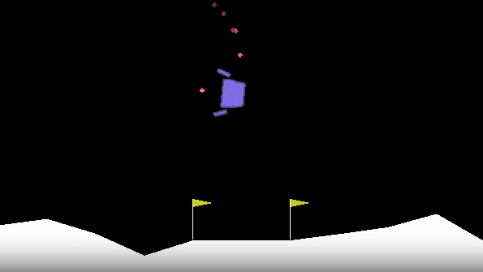

<!-- TOC --><a name="drlearner"></a>
# DRLearner
Open Source Deep Reinforcement Learning library, based on Agent 57 (Badia et al, 2020).
We recommend reading this documentation [page](docs/DRLearner_notes.md) to get the essence of DRLearner. 

# Table of content
- [DRLearner](#drlearner)
- [Table of content](#table-of-content)
  - [System Requirements](#system-requirements)
  - [Installation](#installation)
  - [Running DRLearner Agent](#running-drlearner-agent)
  - [Documentation](#documentation)
  - [Ongoing Support](#ongoing-support)

<!-- TOC --><a name="system-requirements"></a>
## System Requirements

Hardware and cloud infrastructure used for DRLearner testing are listed below. For more information on specific configurations for running experiments, see GCP Hardware Specs and Running Experiments at the bottom of this document.

| Google Cloud Configuration	| Local Configuration |
| --- | --- |
| (GCP)	| (Local) |
| Tested on Ubuntu 20.4 with Python3.7	| Tested on Ubuntu 22.04 with python3.10 |
| Hardware: NVIDIA Tesla, 500 Gb drive 	| Hardware: 8-core i7 |

Depending on exact OS and hardware, packages such as git, Python3.7, Anaconda/Miniconda or gcc. 

## Installation

We recommend [Docker-based](docs/docker.md) installation, however for installation from scratch follow the instructions:


Clone the repo
```
git clone https://github.com/PatternsandPredictions/DRLearner_beta.git
cd DRLearner_beta/
```

Install xvfb for virtual display
```
sudo apt-get update
sudo apt-get install xvfb
```

### Creating environment

#### Conda

Restarting enviroment after creating and activating it is recommended to make sure that enviromental variables got updated.
```
sudo apt-get update
sudo apt-get install libpython3.10 ffmpeg swig
conda create --name drlearner python=3.10
conda activate drlearner

export LD_LIBRARY_PATH=$LD_LIBRARY_PATH:lib:/usr/lib:/usr/local/lib:~/anaconda3/envs/drlearner/lib
export PYTHONPATH=$PYTHONPATH:$(pwd)
conda env config vars set LD_LIBRARY_PATH=$LD_LIBRARY_PATH:lib:/usr/lib:/usr/local/lib:~/anaconda3/envs/drlearner/lib
conda env config vars set PYTHONPATH=$PYTHONPATH:$(pwd)
```

Install packages
```
pip install --no-cache-dir -r requirements.txt
pip install git+https://github.com/ivannz/gymDiscoMaze.git@stable
```

#### Venv
```
sudo apt-get update
sudo apt-get install libpython3.10 swig ffmpeg -y
python3.10 -m venv venv
source venv/bin/activate

export PYTHONPATH=$PYTHONPATH:$(pwd)
```

Install packages
```
pip install --no-cache-dir -r requirements.txt
pip install git+https://github.com/ivannz/gymDiscoMaze.git@stable
```

### Binary files for Atari games
```
sudo apt-get install unrar
wget http://www.atarimania.com/roms/Roms.rar
unrar e  Roms.rar roms/
ale-import-roms roms/

```

## Running DRLearner Agent

DRLearner comes with the following available environments:
 - Lunar Lander:
   - [Config](drlearner/configs/config_lunar_lander.py)
   - [Synchronous Agent](examples/run_lunar_lander.py)
   - [Asynchronos Agent](examples/distrun_lunar_lander.py)
 - Atari:
   - [Config](drlearner/configs/config_atari.py)
   - [Synchronous Agent](examples/run_atari.py)
   - [Asynchronos Agent](examples/distrun_atari.py)
   - [Example](docs/atari_pong.md)
 - Disco Maze
   - [Config](drlearner/configs/config_discomaze.py)
   - [Synchronous Agent](examples/run_discomaze.py)
   - [Asynchronos Agent](examples/distrun_discomaze.py)

### Lunar Lander example

#### Training
```
python ./examples/run_lunar_lander.py --num_episodes 1000 --exp_path experiments/test_pong/ --exp_name my_first_experiment 
```
Correct terminal output like this means that the training has been launched successfully:

`[Enviroment] Mean Distillation Alpha = 1.000 | Action Mean Time = 0.027 | Env Step Mean Time = 0.000 | Episode Length = 63 | Episode Return = -453.10748291015625 | Episodes = 1 | Intrinsic Rewards Mean = 2.422 | Intrinsic Rewards Sum = 155.000 | Observe Mean Time = 0.014 | Steps = 63 | Steps Per Second = 15.544
[Actor] Idm Accuracy = 0.12812499701976776 | Idm Loss = 1.4282478094100952 | Rnd Loss = 0.07360860705375671 | Extrinsic Uvfa Loss = 36.87723159790039 | Intrinsic Uvfa Loss = 19.602252960205078 | Steps = 1 | Time Elapsed = 65.282
` 

To specify which directory to save changes in please specify exp_path. If model already exists in exp_path it will be loaded and training will resume. 
To name experiment in W&B please specify exp_name flag. 

#### Observing Lunar Lander in action
To visualize any enviroment all you have to do is pass an instance of StorageVideoObserver to the enviroment. You pass and instance of DRLearnerConfig to the observer. In the config you can define 

```
observers = [IntrinsicRewardObserver(), DistillationCoefObserver(),StorageVideoObserver(config)]
loop = EnvironmentLoop(env, agent, logger=logger_env, observers=observers)
loop.run(FLAGS.num_episodes)
```



#### Training with checkpoints (Montezuma)

Model will pick up from the moment it stopped in the previous training. Montezuma is the most difficult game so make sure you have enough computational power. Total number of actors is defined as number_of_actors_per_mixture*num_mixtures. If you will try to run too many actors your setup might break. If you have 16 cores of CPU we advice aroud 12 actors total.

```
python ./examples/distrun_atari.py  --exp_path artifacts/montezuma_base --exp_name montezuma_training
```

More examples of synchronous and distributed agents training within the environments can be found in `examples/` .

## Documentation
  - [Debugging and monitoring](docs/debug_and_monitor.md)
  - [Docker installation](docs/docker.md)
  - [Apptainer on Unity cluster](docs/unity.md)
  - [Running on Vertex AI](docs/vertexai.md)
  - [Running on AWS](docs/aws-setup.md)

## Ongoing Support

Join the [DRLearner Developers List](https://groups.google.com/g/drlearner?pli=10).

