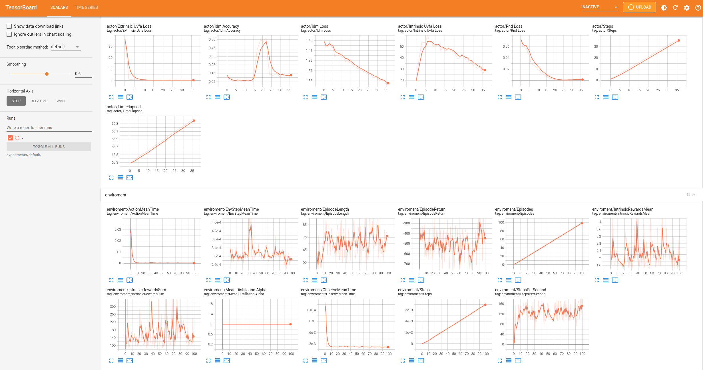
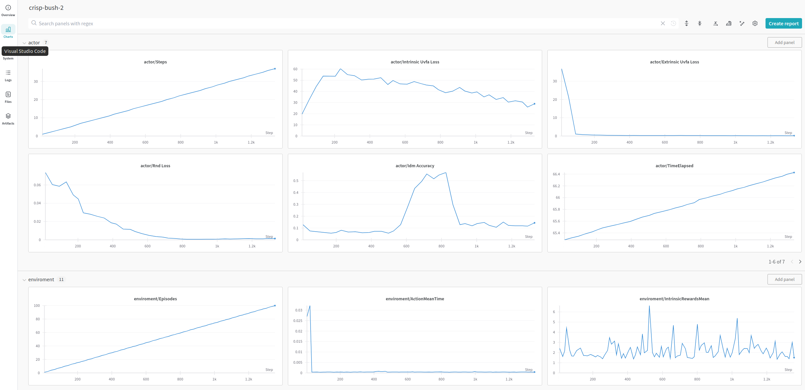

# Debuging and monitoring
Our framwork supports several loggers to help monitor and debug trained agents. All checkpoints will be saved in the workdir directory passed to the agent. 
Currently we log 18 different parameters. 7 for the actor and 11 for the enviroment but those can be easily extended by the user. 
Actor's parameters: 

## Terminal logger 
Terminal logger  logs progress to standard output. To use it please pass an instance of TerminalLogger to agent and enviroment. Logs aren't saved anywhere.

## Tensorboard logger 
This framework supports standard tensorboard logger. To use it please pass an instance of TFSummaryLogger to agent and enviroment. Logs will be saved in the workdir directory passed to the  TFSummaryLogger logger. To visualize the logs please run code snipet below.
```
tensorboard --logdir <log directory>

```


## CSV Logger
This is standar csv logger. To use it please pass an instance of CSVLogger (or CloudCSVLogger when running on vertex) to agent and enviroment. Logs will be saved in the workdir directory passed to the logger.

## Weights and biases
Our framework support [W&B](https://wandb.ai/) logger. It is installed along with the python requirements.txt. To use it please use code snipet below.
```
from drlearner.utils.utils import make_wandb_logger
```
or directly
```
from drlearner.utils.utils import WandbLogger
```
Set WANDB_API_KEY enviromental variable to your personal api key. If you are using doker/compose you can set your enviromental variable in the ".env" file. You can find api key on your W&B profile > user settings > Danger zone > reveal api key.
Logs will be saved locally to /wandb directory and on your W&B account in the cloud.


### Combining loggers
To use more than one logger please see code snipet below
```
wandb_logger=WandbLogger(logdir=tb_workdir, label=label,hyperparams=hyperparams)
tensorboard_logger=TFSummaryLogger(logdir=tb_workdir, label=label)
terminal_logger=loggers.terminal.TerminalLogger(label=label, print_fn=print_fn)

all_loggers = [wandb_logger,tensorboard_logger,terminal_logger]

logger = loggers.aggregators.Dispatcher(all_loggers, serialize_fn)
logger = loggers.filters.NoneFilter(logger)
```
